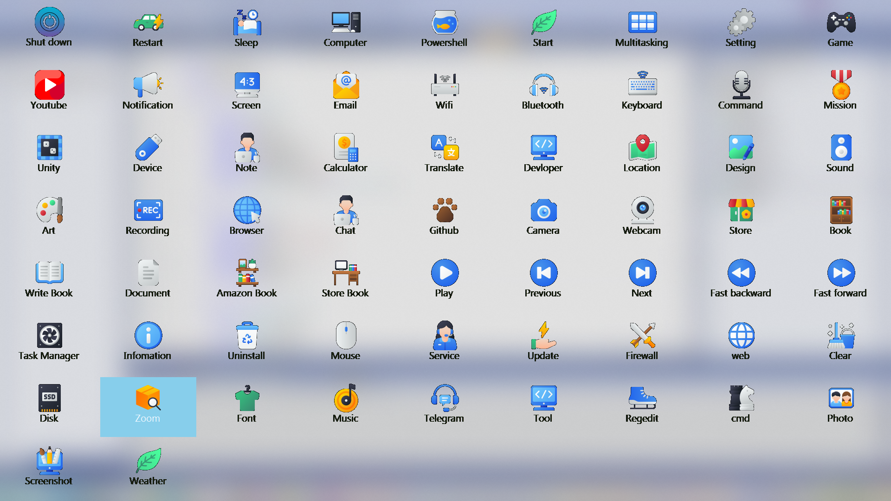
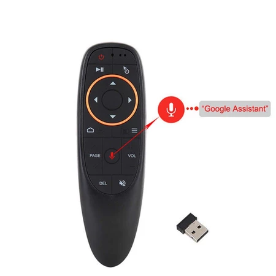
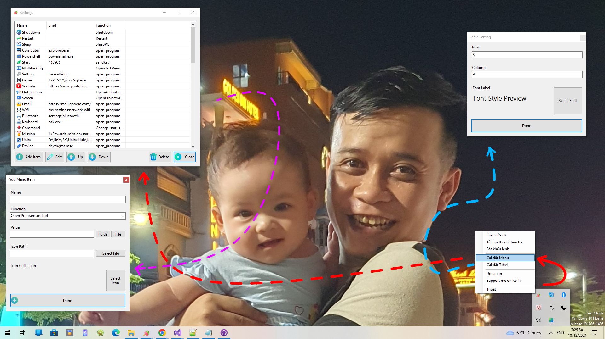

## Remote HID - Remote Control Menu Creator

Remote HID is a versatile application designed to help users create remote control menus with enhanced functionality for system navigation and control. This tool is specifically tailored for remote control devices, such as air mice, enabling seamless interaction with your computer.

---

### Features

1. **Customizable Control Menus**  
   - Easily create and manage custom control menus to suit your specific needs.  
   - Beautifully designed menu interface that is intuitive and visually appealing.  

2. **Voice Command Support**  
   - Open programs and execute commands effortlessly using voice recognition technology.

3. **Shortcut Management**  
   - Simplify workflows with easy-to-create and intuitive shortcuts.  
   - Assign shortcuts to frequently used applications or commands.

4. **Apps Key Activation**  
   - Activate the control menu instantly using the **Apps** (Context Menu) key on your keyboard.  
   - Streamline your interaction without additional setup or extra hardware.

5. **Optimized for Remote Devices**  
   - Specially developed to support air mouse devices, enhancing the remote control experience.  
   - Smooth and responsive navigation.
   

---

### Use Cases

- **System Control:** Navigate and operate your computer remotely with customized menus.  
- **Voice-Activated Commands:** Execute tasks and open programs hands-free.  
- **Productivity Boost:** Use shortcuts and tailored menus to save time and increase efficiency.

---

### Getting Started

1. **Installation:**  
   Download and install the application from the official website or supported app stores.

2. **Setup:**  
   - Launch the application.  
   - Design your custom menu with the easy-to-use interface.  
   - Assign commands, shortcuts, or voice actions to menu items.  

3. **Activation:**  
   Use the **Apps** key on your keyboard to activate your custom control menu and start controlling your system remotely.
   

---

### Compatibility

- Supported on major operating systems including Windows, macOS, and Linux.  
- Works seamlessly with air mouse devices and other remote control peripherals.

---

### Feedback & Support

We value your feedback! If you encounter issues or have suggestions, feel free to contact us via:  
- Email: kurotsmile@gmail.com 
- Email2: tranthienthanh93@gmail.com
- Phone:+840978651577

---

### License

Remote HID is distributed under the [MIT License](LICENSE). Feel free to customize and distribute the software in accordance with the license terms.

---

**Empower your remote control experience with Remote HID!**  
